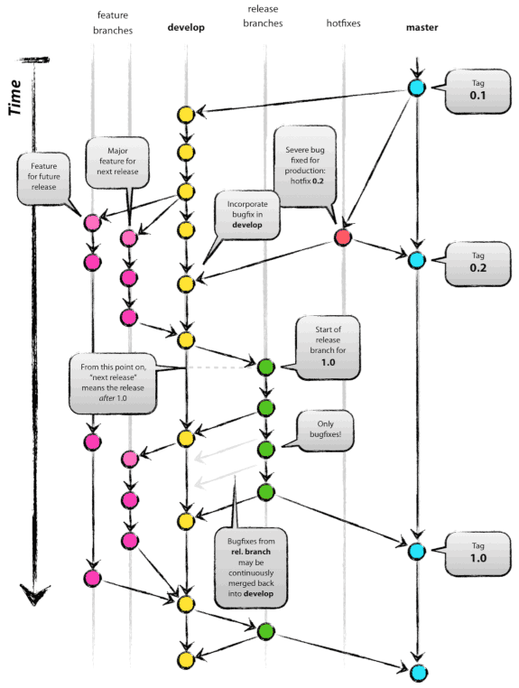

# Git 사용법

간간히 깃에 대해서 공부하고 이해한 내용을 정리한 것입니다.

## Git Flow



## 용어

**Local Repository**: 로컬 저장소  // .git  
**Remote Repository**: 원격 저장소  // origin  
**Working Directory**: 파일 수정이나 저장 등의 작업을 하는 공간  
**Staging Area**: 저장소에 커밋하기 전에 준비하는 위치  
**Commit**: 현재의 변경된 작업 상태를 스테이징 해서 점검하고 나면, 확정하고 작업 내역을 저장소에 저장하는 작업  
**Snapshot**: 특정 시점에서의 폴더나 파일 같은 작업 디렉토리의 변경 상태를 의미하며, 스테이징이나 커밋을 할 때 이전 스냅샷과의 변경점이 기록된다  
**Branch**: 분기점으로, 이후에 충돌하는 작업물이 없는 파일에 한해서 메인 브랜치와 다시 병합할 수 있다  
**HEAD**: 특정 브랜치에서 현재 작업 중인 커밋을 가리키며, @로 대체해서 표기할 수 있다  
**Main(Integration) Branch**: 언제든 배포할 수 있어야 하는 릴리즈 브랜치와 병합되는 가장 안정적이고 중심이 되는 브랜치  
**Develop Branch**: 처음부터 메인 브랜치에서 분리되어 개발을 위해 사용하는 브랜치  
**Feature(Topic) Branch**: 기능 추가, 버그 수정 같은 단위 작업을 하기 위해 개발 브랜치에서 갈라져 나와서 이후에 다시 병합되는 작업 브랜치  
**Release Branch**: 더 이상의 기능 추가 대신 버그 수정 등의 최종 점검을 위해 개발 브랜치에서 갈라져 나와서 이후에 메인 브랜치와 개발 브랜치로 병합되는 언제든 배포할 수 있어야 하는 브랜치  
**Hotfix Branch**: 메인 브랜치에서 임시로 갈라져 나와서 긴급한 버그 수정 후에 메인 브랜치와 개발 브랜치로 병합되는 브랜치  
**Checkout**: 브랜치나 커밋을 불러오거나 파일을 복원하는 작업  
**Switch**: 오로지 브랜치를 전환하거나 생성하는 작업  
**Rebase**: 현재 브랜치의 분기점 커밋을 특정 브랜치의 헤드로 이동시켜서 재배치  
**Merge**: 현재 작업 공간을 특정 브랜치의 헤드의 커밋과 현재 브랜치의 헤드 커밋을 합친 상태로 변경  
**Fast-forward**: 현재 브랜치에서 병합할 브랜치가 생성된 후 새로운 커밋이 존재하지 않은 상태라면, 현재 브랜치의 헤드가 병합할 브랜치의 헤드로 이동하는 병합 방식

## 커밋 메시지 관습

```bash
<commit_message_header>
<빈칸>
<commit_message_body>
<빈칸>
<commit_message_footer>
```

### 1. 머리글(Header): `<type>(scope): <subject>`

**type**: 커밋의 종류

* feat: 새로운 기능을 추가
* fix: 버그를 수정
* design: CSS 등에서 사용자 UI 디자인을 변경
* docs: 함수, 객체, 메소드 등에 대한 주석이나 문서를 변경
* style: 기능에 영향이 없는 선에서 단순한 코드 구조를 변경
* refactor: 추후 더 복잡한 기능 구현을 위해서 기존 코드의 재사용성을 높이는 코드 구조 변경
* rename: 파일 이름을 변경
* remove: 파일을 삭제
* test: 테스트 코드를 변경
* build: 빌드 파일을 수정
* ci: CI 설정 파일을 수정
* perf: 최적화 등 성능을 개선
* chore: 자잘한 수정이나 빌드를 업데이트

**scope**: 선택 사항이며, 함수, 객체, 메소드 등 변경된 부분을 직접적으로 표기  
**subject**: 변경 내용을 간략하게 표현할 수 있는 제목

* 영문 기준 최대 50자로 제한
* 첫 글자는 대문자
* 동사원형을 사용하여 명령문의 형태로 작성
* 마침표(.) 사용 금지

### 2. 본문(Body)

선택 사항이며, 각 줄은 영문 기준 최대 72자로 제한  
어떻게 변경했는지보다 무엇을 변경했고 왜 변경했는지를 설명  
깃에서 변경 내역을 구체적으로 찾아 볼 수 있기 때문  

### 3. 바닥글(Footer): `Fixes: #1, #2`

선택 사항이며, 관련된 이슈를 언급  
**이슈 키워드**: Closes(종료), Fixes(수정), Resolves(해결), Ref(참고), Related to(관련)

## .gitignore

깃 버전 관리에서 제외할 파일 목록을 설정하는 파일  
항상 작업 공간의 최상위 경로에 위치해야 한다  

* 표준 Glob 패턴을 사용: 와일드 카드 등
* `#`로 주석 작성
* `!`로 시작하는 패턴의 파일은 미적용
* `/`로 시작하면 하위 폴더는 미적용
* `/`로 끝나면 폴더만 해당  // 아니면 폴더와 파일 둘 다 해당

## 명령어

### 0. 메크로

HEAD는 `@` 기호로 대체 가능  
`HEAD~n`은 현재 브랜치 헤드에서 `n` 번째 떨어진 커밋을 의미  
`HEAD^`은 현재 브랜치 헤드 바로 전 커밋을 의미  
`<branch_name>~n`은 해당 브랜치 헤드에서 `n` 번째 떨어진 커밋을 의미  
`<branch_name>^`은 해당 브랜치 헤드 바로 전 커밋을 의미  
`<commit_hash>~n`은 해당 커밋에서 `n` 번째 떨어진 커밋을 의미  
`<commit_hash>^`은 해당 커밋 바로 전 커밋을 의미  

### 1. 초기 설정(전역으로 설정하는 옵션: `--global`)

로컬 저장소 생성: `git init`  
사용자 이름 설정: `git config user.name "<user_name>"`  
사용자 이메일 설정: `git config user.email "<user_email>"`  
루트 브랜치 이름을 master에서 main으로 변경: `git config init.defaultBranch main`  
개행 문자 커밋 옵션 설정: `git config core.autocrlf <option>`

* 문서의 줄 바꿈을 커밋 시에는 LF 형식으로 자동 변환하고, 체크아웃 시에는 CRLF 형식으로 자동 변환하는 옵션: `true`
* 문서의 줄 바꿈을 커밋 시에는 LF 형식으로 자동 변환하고, 체크아웃 시에는 변환하지 않는 옵션: `input`(권장 옵션)
* 문서의 줄 바꿈을 변환하지 않는 옵션: `false`

원격 저장소 클론: `git clone "<remote_repo_url>"`  
반복적으로 묻는 개인정보를 `~/.git-credentials`에 15분 동안 저장: `git config credential.helper cache`  
반복적으로 묻는 개인정보를 `~/.git-credentials`에 3600초 동안 저장: `git config credential.helper cache --timeout=3600`  
반복적으로 묻는 개인정보를 `~/.git-credentials`에 영구적으로 저장: `git config credential.helper store`  
지역 및 전역 환경 설정 리스트 출력: `git config --list`

### 2. 스테이징 및 커밋

스테이지 상태 확인: `git status`  // 요약하는 옵션: `-s`  
스테이지 영역에 파일 추가: `git add "<file_name>"`  
스테이지 영역에 수정된 모든 파일 추가: `git add -A`, `git add -all`  
스테이지 영역 초기화: `git reset`    // 커밋 되돌리기 항목 참고
커밋: `git commit`

* 직전 커밋에 덮어 씌우는 옵션: `--amend`
* 편집기를 열기 않고 제목을 추가하는 옵션: `-m "<commit_message_header>"`
* 편집기를 열기 않고 제목과 본문을 추가하는 옵션: `-m "<commit_message_header>" -m "<commit_message_body>"`
* 추적 상태인 수정된 파일을 스테이징 및 커밋하는 옵션: `-a`

해당 커밋으로 헤드(작업 공간)를 전환: `git checkout <branch_name>~n`, `git checkout <commit_hash>`  

저장소와 작업 공간에서 파일 이름 변경: `git mv "<old_name>" "<new_name>"`  
저장소와 작업 공간에서 파일 삭제:

* `git rm "<file_name>"`  // 스테이지 영역에서만 삭제하는 옵션: `--cached`
* `git restore "<file_name>"`  // 스테이지 영역에서만 삭제하는 옵션: `--staged`

### 3. 커밋 이력

커밋 내역 출력: `git log`

* 모든 브랜치를 표기하는 옵션: `--all`
* 최근 n개의 커밋들만 표기하는 옵션: `-n`
* 변경 내역을 비교하는 옵션: `-p`
* 아스키 그래프로 출력하는 옵션: `--graph`
* 태그와 브랜치 정보를 제거하는 옵션: `--no-decorate`
* 파일의 추가/삭제된 통계 데이터를 출력하는 옵션: `--stat`
* 커밋마다 한 줄로 커밋 내역 출력하는 옵션: `--oneline`

요약된 커밋 내역 출력: `git shortlog`  
파일 이력 출력: `git log "<file_name>"`  // 변경 내역을 비교하는 옵션: `-p`  
파일에 대한 모든 수정 내역 출력: `git blame "<file_name>"`  

### 4. 커밋 정보 비교(변화가 생긴 파일 목록만 표기하는 옵션: `--name-only`)

커밋의 정보와 수정사항 보기: `git show "<commit_hash>"`  
최근 커밋과 현재 작업 디렉토리 파일을 비교: `git diff`  // 최근 커밋과 현재 스테이지된 파일 비교하는 옵션: `--staged`  
헤드에서 x번째 떨어진 커밋을 기준으로 헤드에서 y번째 떨어진 커밋을 비교: `git diff HEAD~x HEAD~y`  
1번 커밋 해시를 기준으로 2번 커밋 해시를 비교: `git diff "<commit_hash_1>" "<commit_hash_2>"`  
현재 브랜치와 해당 브랜치를 비교: `git diff "<branch_name>"`  

### 5. 커밋 되돌리기

해당 커밋으로 되돌리기: `git reset HEAD~n`, `"git reset "<commit_hash>"`

* 현재 작업 공간과 스테이지 항목을 보존하고, 해당 커밋 이후의 커밋 기록을 지우는 옵션 : `--soft`
* 현재 작업 공간을 보존하고, 해당 커밋 이후의 커밋 기록을 지우는 옵션: `--mixed`(기본 옵션)
* 현재 작업 공간을 해당 커밋으로 변경하고, 이후의 커밋 기록을 지우는 옵션: `--hard`

현재 작업 공간을 해당 커밋으로 변경하고, 스테이징 및 커밋: `git revert HEAD~n`, `git revert "<commit_hash>"`

* `git reset --hard`와 달리 커밋 기록을 지우지 않는다
* 해당 커밋에 기록된 스냅샷을 기반으로 커밋하기 때문에 현재의 작업 공간이 스냅샷에 기록된 파일과 충돌할 수 있음을 주의!
* 바로 커밋하지 않고 스냅샷에 기록된 변경 사항을 스테이징만 하는 옵션: `-n`, `-no--commit`

### 6. 브랜치

해당 커밋에서부터 새로운 브랜치 생성: `git branch "<branch_name>" "<commit_hash>"`  
브랜치 리스트 보기: `git branch`

* 로컬 저장소와 원격 저장소의 모든 브랜치 리스트 보기 옵션: `-a`, `-all`
* 브랜치 이름 변경 옵션: `-m`, `--move`
* 병합된 브랜치를 삭제하는 옵션: `-d`, `--delete`
* 브랜치를 강제로 삭제하는 옵션: `-D`

작업 공간을 해당 브랜치로 전환: `git switch "<branch_name>"`  // 브랜치 생성 후 바로 전환하는 옵션: `-c`  
현재 브랜치 헤드에 해당 브랜치 헤드를 병합하고 커밋을 생성: `git merge "<branch_name>"`  // Fast-forward가 가능한 경우에는 커밋을 따로 생성하지 않음

* 편집기를 열기 않고 제목을 추가하는 옵션: `-m "<commit_message_header>"`
* 편집기를 열기 않고 제목과 본문을 추가하는 옵션: `-m "<commit_message_header>" -m "<commit_message_body>"`
* 병합될 브랜치의 모든 커밋들을 하나의 커밋으로 합치는 옵션: `--squash`
* Fast-forward가 가능한 경우라도 하지 않게 하는 옵션: `--no-ff`  // 깔끔한 커밋 기록만 있어야 하는 메인 브랜치에 유용

현재 브랜치의 조상 커밋을 해당 브랜치 헤드로 재배치: `git rebase "<branch_name>"`  
현재 브랜치의 최근 n 개의 커밋을 수정하기 위해 설정 문서와 상호작용 : `git rebase HEAD~n`  

### 7. 원격 저장소

원격 저장소 연결: `git remote add "<remote_repo_name>" "<remote_repo_url>"`  
추가한 원격 저장소 목록 보기: `git remote` // 상세히 보기 옵션: `-v`  
원격 저장소 url 얻기: `git remote get-url "<remote_repo_name>"`  
원격 저장소 정보 보기: `git remote show "<remote_repo_name>"`  
원격 저장소 이름 변경: `git remote rename "<old_remote_repo_name>" "<new_remote_repo_name>"`  
원격 저장소 제거: `git remote remove "<remote_repo_name>"`  
원격 저장소로 브랜치 올리기: `git push "<remote_repo_name>" "<local_branch_name>"`  

* 강제로 올리는 옵션: `-f`, `--force`
* 로컬 저장소와 원격 저장소를 계속 연동시키는 옵션: `-u`

원격 저장소에서 브랜치 내려받기: `git fetch "<remote_repo_name>" "<remote_branch_name>"`  
원격 저장소에서 브랜치 내려받는 동시에 현재 브랜치 헤드에 병합: `git pull "<remote_repo_name>" "<remote_branch_name>"`  

### 8. 태그(한 번 지정한 태그는 수정이 불가능하지만, 새로운 태그를 추가하거나 삭제할 수 있다)

현재 브랜치 헤드에 경량 태그 지정: `git tag "<lightweight_tag_name>"`  
해당 커밋에 경량 태그 지정: `git tag "<lightweight_tag_name>" "<commit_hash>"`  

* 경량 태그는 단순히 커밋 해시의 주소를 가리키는 포인터다
* 커밋 해시 대신에 경량 태그 이름을 사용하면 태그 이름이 커밋 해시로 자동 역참조 된다

현재 브랜치 헤드에 주석 달린 태그 지정: `git tag -a "<annotated_tag_name>"`  // 편집기를 열기 않고 태그 메시지를 추가하는 옵션: `-m "<tag_message>"`  
해당 커밋에 주석 달린 태그 지정: `git tag -a "<annotated_tag_name>" "<commit_hash>"`  // 편집기를 열기 않고 태그 메시지를 추가하는 옵션: `-m "<tag_message>"`  

* 주석 달린 태그는 자체 태그 해시의 주소를 가리키는 포인터다
* 주석 달린 태그 해시는 커밋 해시의 주소를 가리키는 포인터다
* 따라서 커밋 해시 대신에 주석 달린 태그 이름을 사용하려면 역참조 과정을 한 번 거쳐야 한다  // 주석 달린 태그에 대한 역참조: `<annotated_tag_name>^{}`

로컬 저장소의 태그 목록 보기: `git tag` // 조건에 맞는 태그 보기 옵션: `-l "<part_of_tag_name>*"`, `--list "<part_of_tag_name>*"`  
해당 태그에 대한 정보 보기: `git show "<tag_name>"`  
모든 태그가 가리키는 주소를 보기: `git show-ref --tags`  // 주석 달린 태그의 역참조 정보까지 보는 옵션: `--dereference`  
태그 이름 변경: `git "<old_tag_name>" "<new_tag_name>"`  
로컬 저장소에서 해당 태그 삭제: `git tag -d "<tag_name>"`, `git tag --delete "<tag_name>"`  
원격 저장소로 해당 태그 올리기: `git push "<remote_repo_name>" "<tag_name>"`  
원격 저장소로 모든 태그 올리기: `git push "<remote_repo_name>" --tags`  
원격 저장소의 태그 목록 보기: `git remote --tags`  
원격 저장소에서 해당 태그 삭제: `git push "<remote_repo_name>" -d "<tag_name>"`, `git push "<remote_repo_name>" --delete "<tag_name>"`  

### 9. 작업 임시 저장(추적 상태인 파일에 한해서만 가능)

현재 변경 사항을 임시 저장: `git stash`  // 메시지를 추가하는 옵션: `-m "<stash_message>"`  
임시 저장된 작업 내역 보기: `git stash list`  
해당 임시 저장된 작업 적용: `git stash apply "<stash_name>"`  
해당 임시 저장된 작업 삭제: `git stash drop "<stash_name>"`  
모든 임시 저장된 작업 삭제: `git stash clear`  

### 10. 서브 모듈

해당 경로에 서브 모듈 추가: `git submodule add "<submodule_url>" "<submodule_path>"`  
서브 모듈 정보를 초기화하고 다운로드: `git submodule init && git submodule update`  // 서브 모듈이 포함된 저장소를 클론 했을 경우에 사용  
서브 모듈 상태 확인: `git submodule status`  
서브 모듈 삭제: `git submodule deinit -f "<submodule_path>" && rm -rf ".git/modules/<submodule_name>" && git rm -rf "<submodule_path>"`  
